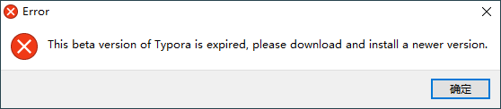
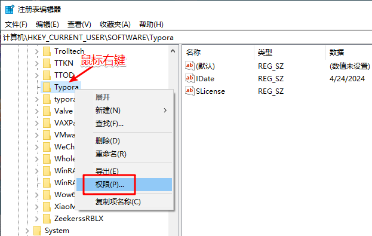
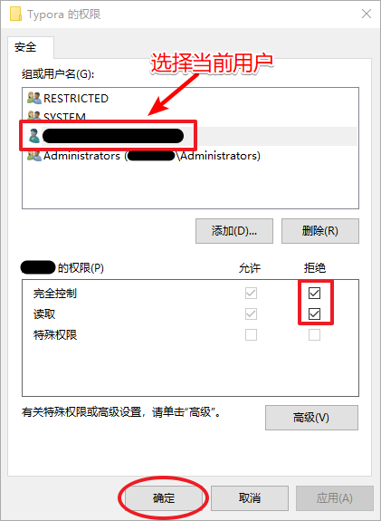

# Typora-0.11.18 报错处理

安装后打开会弹窗报错:

原因是因为 Typora-0.11.18 是免费版, 在系统注册表中记录了一个最后使用时间, 超过将无法使用.

# 解决办法

1. 打开注册表：按 `Win` + `R` 键打开运行窗口，输入 ` regedit`

    

2. 进入路径 `计算机\HKEY_CURRENT_USER\SOFTWARE\Typora`

    

    

设置好点【确定】后再打开 Typora 就可以啦~
